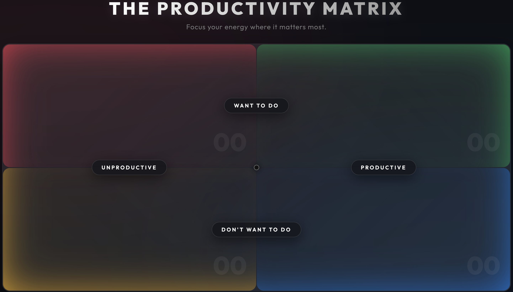

# The Productivity Matrix

Welcome to **The Productivity Matrix** — a premium, physics-based, digital board to master your time and prioritize your focus. Built with performance and aesthetics in mind, this application reimagines the standard priority matrix into an elegant, spatial, freeform board. 



## 🌟 Key Features

* **Spatial Freeform Task Mapping:** Move away from standard, rigid lists. Tasks are intelligently scattered at randomized coordinates with subtle rotations, mirroring the feel of physical sticky notes.
* **Physics-Based Drag & Drop:** Fluid, precise repositioning. The application dynamically calculates XY drop coordinates, seamlessly shifting your tasks into absolute bounds inside the appropriate quadrant.
* **Collision Avoidance Algorithm:** Newly created tasks actively scan existing sibling nodes to proactively seek empty space, ensuring a clutter-free visual representation.
* **Premium Glassmorphism Aesthetics:** Engineered with modern, eye-catching design patterns—featuring immersive hover state animations, shimmering effects, and custom-styled scrolling natively injected via CSS.
* **Inline Editing:** Instantly double-click any task to transform it directly into an input state, avoiding clunky pop-ups or external modals.
* **Local Persistence:** Your data never leaves your device. The app seamlessly synchronizes state natively with browser `localStorage`. 

## 🚀 Quick Start

Ensure you have [Node.js](https://nodejs.org/) installed, then follow these steps:

1. **Clone or Download the Repository**
2. **Install Dependencies**
   ```bash
   npm install
   ```
3. **Run the Development Server**
   ```bash
   npm run dev
   ```
4. **Build for Production** 
   ```bash
   npm run build
   ```

## 🛠 Tech Stack

* **Frontend Framework:** Vite
* **Core Languages:** Vanilla JavaScript (ES6+), HTML5, CSS3
* **State Management:** LocalStorage API
* **Interactivity:** HTML5 Drag and Drop API

## 📝 Usage Outline

1. **Add Tasks**: Click any quadrant background to reveal an elegant quick-add form at the base.
2. **Move Tasks**: Left-click and drag tasks freely across the screen. They will snap precisely to where you drop them.
3. **Edit Tasks**: Double-click any task text to modify it on the fly.
4. **Delete Tasks**: Hover over a task and click the subtle 'x' button. 

---
*Focus your energy where it matters most.*
